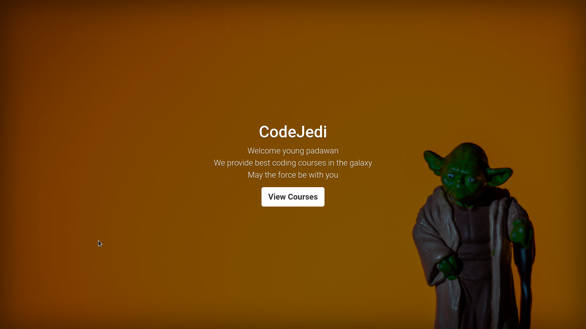
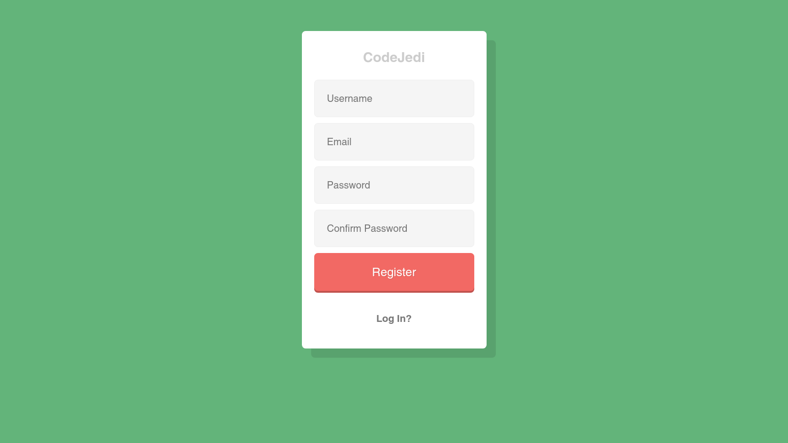
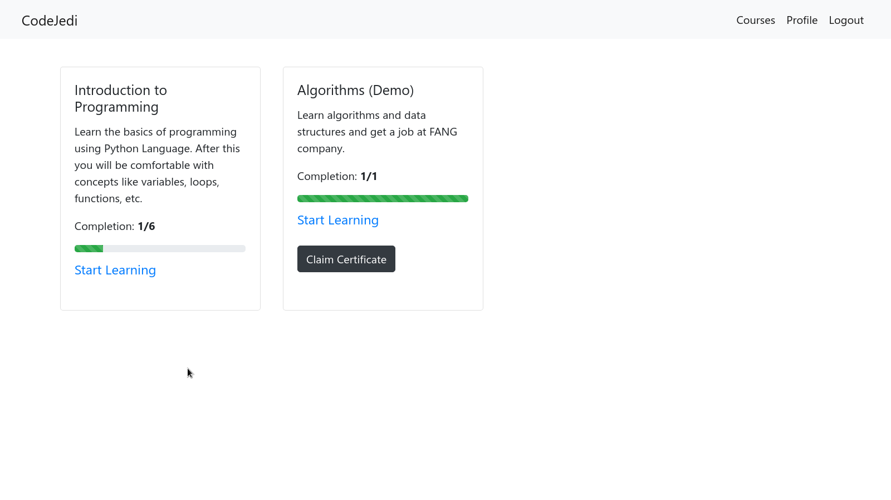
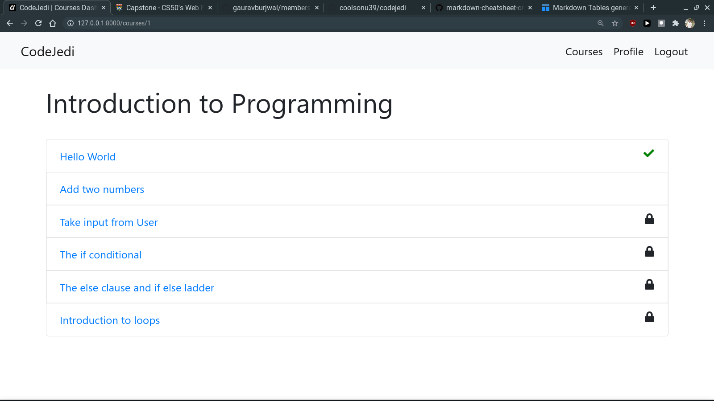
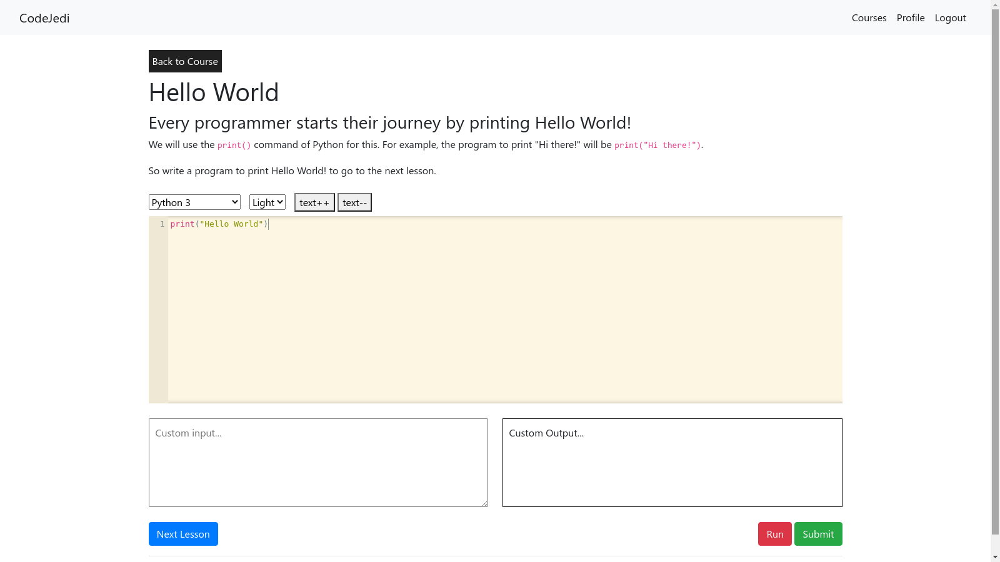
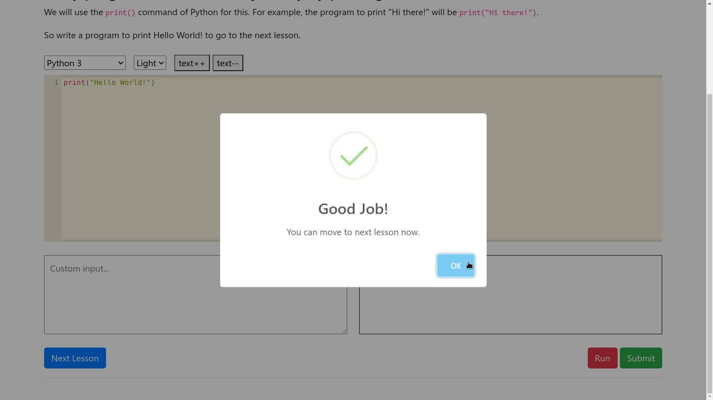
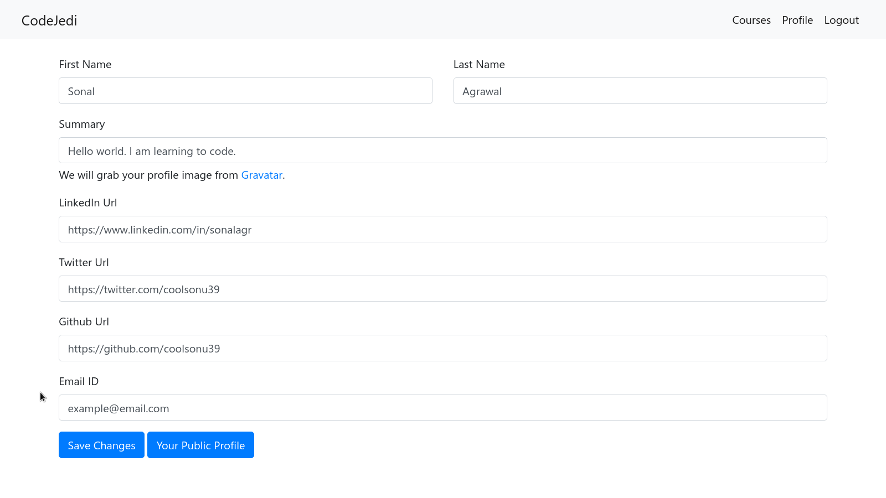
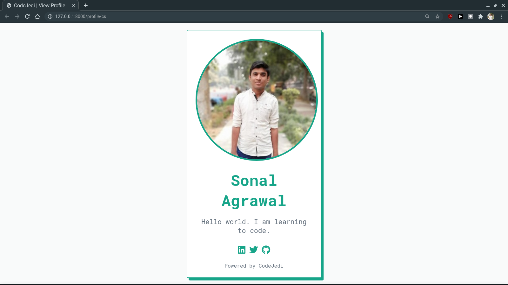
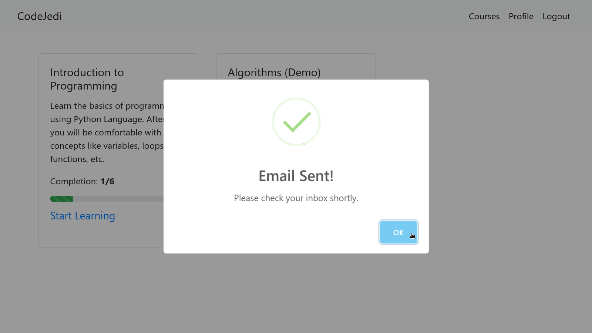

# CodeJedi
This is a website to learn and practice your programming skills. It is somewhat similar to FreeCodeCamp. It was made for [CS50W's Final Project](https://cs50.harvard.edu/web/2020/projects/final/capstone/).

## Installation and Usage
Python and Django is required to run the project locally. Make sure to install requirements and migrate the database before starting the server.

```bash
git clone https://github.com/coolsonu39/codejedi.git
cd codejedi
pip3 install -r requirements.txt
python manage.py migrate
python manage.py runserver
```

Use `python3 manage.py createsuperuser` to access the admin panel at `/admin`. Also register for a free [JDoodle](https://www.jdoodle.com/compiler-api/) account to get your API keys. Then create a `.env` file inside the `mainsite` directory with the following keys.

```
clientSecret=<jdoodle client secret>
clientId=<jdoodle client id>
sender_email=<your gmail id>
password=<your gmail password>
```

You may need to [allow less secure apps](https://myaccount.google.com/lesssecureapps) in order to send emails.

## Screenshots

### Landing page


### Login / Register


### Course list


### Course details and lessons




### Edit profile and Public profile page



### Claim Certificate


## A brief description
There are various lessons divided into courses. After completion of a course a user can claim the certificate for it. We cannot access a lesson without completing previous ones. A user can run the code with their own custom input and then submit against predefined test cases after being sufficiently confident (although there is no upper limit on number of tries). There is also a public profile section link that can be shared with anyone and doesn't require login (like a portfolio/visiting card). An admin can control all the database information and create new courses from the admin panel.

## Other Details and Justification (for grading purposes)
- All pages are responsive and look relatively good on mobile devices.
- This project is neither a social network nor an ecommerce site.
- There are four models with interconnecting relationships (as opposed to just one)
- The admin panel's header is modified
- Support for multiple languages on per course basis
- Using [CodeMirror](https://codemirror.net/) for rendering the editor in the frontend
- Certificates are generated using Pillow library
- A welcome email is sent after registering (without using any third party service)
- THANK YOU!